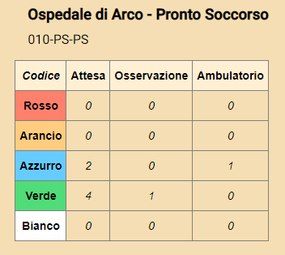

# Stato Pronto Soccorso Trentini

Applicazione web per la consultazione dello stato dei pronto soccorsi Trentini.

## Realizzazione
L'applicazione è realizzata in [Angular](https://angular.io/), con l'ausilio del design Material di Angular [Angular Material](https://angular.io/).

---

## Funzionamento
L'applicazione fornisce una tabella per pronto soccorso in questo modo:

Per ogni pronto soccorso viene mostrato:
* Ospedale - Reparto.
* Codice reparto.
* Tabella per la consultazione dei codici.

## Come funziona l'accesso al pronto soccorso
Normalmente l'accesso al pronto soccorso trentino funziona in questo modo:

1. Arrivo del paziente(PZ) in pronto soccorso(PS).
2. Accettazione del PZ da parte dell'infermiera di Triage.
3. Assegnazione di un codice colore e di un identificativo.

Ora, in base alla lista **d'attesa** e al codice colore ricevuto si dovrà aspettare di essere chiamati dal Medico di PS o dall'infermiera di triage.

Una volta chiamati si entra in **ambulatorio**, dove si viene visitati dal medico e l'infermiera di ambulatorio esegue gli accertamenti del caso.

Dopo i vari accertamenti si passa in **osservazione** in attesa dei referti, per decidere la diagnosi e l'eventuale cura.

## Come leggere la tabella
Come potete notare nella prima colonna troviamo i vari codici colori, dal più grave ***Rosso***, al meno grave: ***Bianco***.

Le altre colonne si dividono nel seguente modo:
* **Attesa**:
    * Persone che hanno fatto l'accettazione in triage con l'infermiera di triage.
* **Ambulatorio**:
    * Persone che vengono chiamate dal medico di PS, per eseguire una visita più accurata, e identificare il problema.
* **Osservazione**:
    * Persone in attesa di referto, terapie in corso per la risoluzione di eventuali problematiche.

> I tempi di attesa sono rispettati in base al codice colore, con una progressiva variabilità veros i codici minori (Verde e Bianco).

## Codici colore
* ***Rosso***:
    * Visita immediata (Emergenza).  
* ***Arancio***:
    * Visita con urgenza.
    * _Entro **15 minuti**._
* ***Azzurro***:
    * Visita con urgenza differibile.
    * _Entro 60 minuti - **1 ora**._
* ***Verde***:
    * Visita urgenza minore.
    * _Entro 120 minuti - **2 ore**._
* ***Bianco***:
    * Visita non urgente.
    * _Entro 240 minuti - **4 ore**._

---
## CORS
